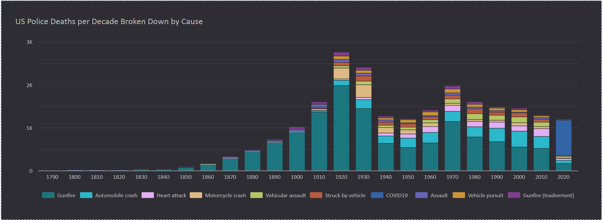
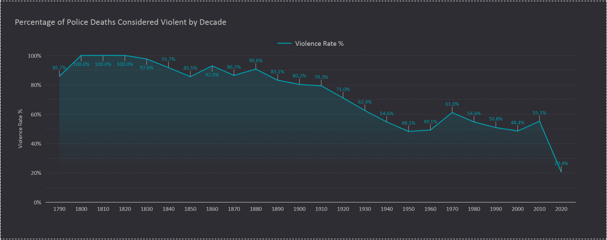
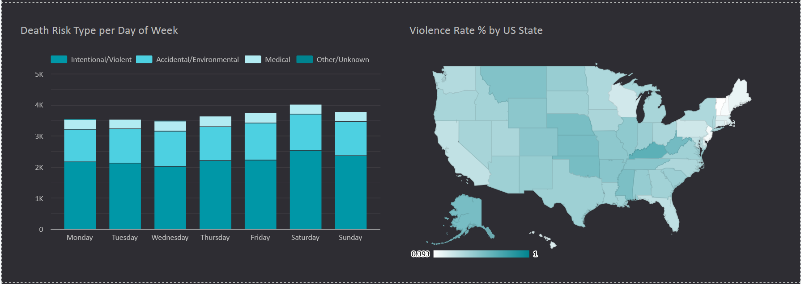

# DataTalksClub Data Engineering Zoomcamp 2026 Final Project

## Problem Statement:
Using the [historical dataset of US police deaths](https://www.kaggle.com/datasets/mayureshkoli/police-deaths-in-usa-from-1791-to-2022/data?select=police_deaths_USA_v7.csv) from Kaggle, create a pipeline using many of the technologies covered in the zoomcampe in order to answer four primary questions for the dataset:
1. What is the breakdown of the causes of deaths for US law enforcement officers?
2. How has the risk profile of American law enforcement shifted over the years when comparing 'Intentional/Violent', 'Accidental/Environmental', and 'Medical' types of causes of deaths?
3. With the same death types categorization, has there been a pattern in the distribution of deaths across different days of the week?
4. What states have historically had the largest percetage of deaths that would categorized as 'Intentional/Violent'?

## Looker Studio Charts to Answer Questions:




## Technologies used:
- WSL:Ubuntu - development environment
- Docker - containerization
- Terraform - infractructure as code
- GCP - cloud
  - Cloud Storage - data lake
  - BigQuery - data warehouse
- Kestra - orchestration
  - batch pipeline
- dbt - transformation
- Looker Studio - dashboard/presentation


## Reproducibility
0. Prerequisites
- [Install Docker and Docker Compose](https://docs.docker.com/compose/install/)
- [Install Terraform](https://developer.hashicorp.com/terraform/tutorials/aws-get-started/install-cli)
- [Install Google Cloud CLI](https://docs.cloud.google.com/sdk/docs/install-sdk)
- Dataset - via Kaggle - [Police deaths in USA from 1791 to 2022](https://www.kaggle.com/datasets/mayureshkoli/police-deaths-in-usa-from-1791-to-2022/data?select=police_deaths_USA_v7.csv)
  - will need to create Kaggle account and create a Kaggle API token (Settings => API Tokens)
- Clone repo
  ```bash
  git clone https://github.com/justigo86/dtc_project_police_deaths_pipeline.git <project_directory>
  cd <project_directory>
  ```
1. [Google Cloud Platform (GCP) Account Required](https://console.cloud.google.com/)
- Create a GCP Project
- Create a GCS Bucket for project
- Create a BigQuery Dataset for project
- Create Service Account with permissions using IAM & Admin for project
  - Create admin roles for Cloud Storage, BigQuery, and Compute Engine
  - Create and download a JSON key for the Service Account
  - Store JSON key in project with .json file (e.g., gcp_creds.json)
2. GCP with Kestra consideration config
- Using .env file as single source of truth - copy example and fill in with info
  ```bash
  cp .env.example .env
  ```~
  ```bash
  echo "SECRET_GCP_CREDS=$(cat gcp-key.json | base64 -w 0)" >> .env
  echo "SECRET_GCP_PROJECT_ID=$(echo -n $GCP_LOCATION | base64 -w 0)" >> .env
  echo "SECRET_GCP_DATASET=$(echo -n $GCP_DATASET | base64 -w 0)" >> .env
  echo "SECRET_GCP_BUCKET_NAME=$(echo -n $GCP_BUCKET_NAME | base64 -w 0)" >> .env
  echo "SECRET_GCP_LOCATION=$(echo -n $GCP_LOCATION | base64 -w 0)" >> .env
  ```
3. Terraform Deployment
- Map to terraform variables - copy and paste into terminal for project directory
  - export TF_VAR_project=$GCP_PROJECT_ID
  - export TF_VAR_region=$GCP_LOCATION
  - export TF_VAR_dataset_id=$GCP_DATASET
  - export TF_VAR_bucket_name=$GCP_BUCKET_NAME
  - export GOOGLE_APPLICATION_CREDENTIALS=$LOCAL_GCP_CREDS_PATH
- Initialize Terraform
  ```bash
  cd 01_terraform
  terraform init
  ```
- Plan Terraform deployment
  ```bash
  terraform plan
  ```
- Apply Terraform deployment
  ```bash
  terraform apply
  ```
4. Launch Docker containers
- From project root directory - launch docker containers for Kestra and dbt
  ```bash
  docker compose up -d
  ```
5. Executing the Pipeline (Kestra)
  - will download dataset from Kaggle API, store raw data in GCS data lake bucket, then transform and load data into BigQuery data warehouse
- Access the Kestra UI: Open http://localhost:8080.
- Run Ingestion: Run the data_ingestion flow in Kestra
  - Copy entire file contents of `02_kestra_pipeline/flows/data_ingestion.yml`
  - On Kestra UI Dashboard, click "Flows", then "Create"
  - Paste contents of `data_ingestion.yml` file under "Flow Code" section
  - Save
  - Click "Triggers" tab, then "Backfill Executions" under Backfill
    - Will need to backfill as flow is set to cron monthly at midnight of the first day of the month
    - E.g., set start date as '2026-01-31 00:00:00' and end date as '2026-02-02 00:00:00' to run for February 2026
  - Click 'Execute backfill'
- Can now view datasets in GCS bucket and query data in BigQuery
6. Dashboard
- Go to Looker Studio: lookerstudio.google.com
  - Create a data source
  - Select Report
  - Connector: BigQuery
  - Authorize Looker Studio to connect to project
  - Select project
  - Can then create visualizations